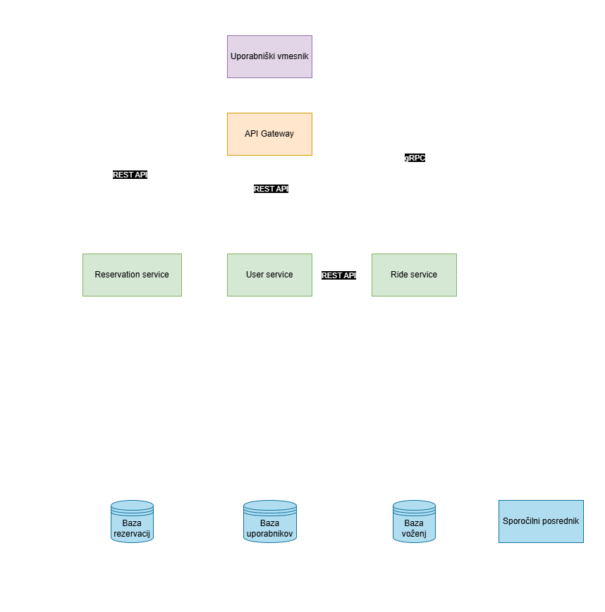

# RideSync 🚕💨

## O projektu 

RideSync je pametna platforma za skupno vožnjo, ki povezuje uporabnike s podobnimi voznimi potmi, da zmanjšajo stroške potovanja in emisij. Sistem omogoča uporabnikom, da enostavno najdejo sopotnike za vsakodnevne vožnje, rezervirajo vožnje in si delijo stroške, kar prispeva k učinkovitejši uporabi vozil in zmanjšanju prometnih zastojev.

## Poslovni problem

Sodobna mesta se spoprijemajo z vedno večjimi težavami, kot so prometni zastoji, onesnaževanje in visoki stroški prevoza. RideSync rešuje te izzive tako, da:

- Omogoča uporabnikom, da najdejo sopotnike za vožnje, kar zmanjša število avtomobilov na cesti.
- Povečuje dostopnost do prevoza za tiste, ki nimajo lastnega vozila, ter omogoča zmanjšanje stroškov prevoza za vse udeležence.
- Povezuje voznike in potnike, kar prispeva k oblikovanju skupnosti in socialne interakcije.

### Osnovna funkcionalnost sistema

Sistem omogoča:

- Iskanje in ujemanje voznikov in potnikov glede na podobne vožnje.
- Rezervacijo vožnje in delitev stroškov.
- Prejemanje obvestil o vožnjah in možnost ocenjevanja voznikov in potnikov.

### Končni uporabniki

Glavni uporabniki sistema so:

- Vozniki, ki želijo deliti vožnje in zmanjšati stroške.
- Potniki, ki iščejo cenovno dostopne in priročne možnosti prevoza.
- Administratorji, ki upravljajo sistem in spremljajo aktivnost.

## Arhitektura sistema 🏰️

Sistem temelji na mikrostoritveni arhitekturi in vsebuje naslednje mikrostoritve:

### 1. UserService (REST API)

Skrbi za registracijo, avtentikacijo in upravljanje uporabniških podatkov.

Omogoča uporabnikom urejanje osebnih podatkov in nastavitev.

### 2. RideService (gRPC)

Upravlja z vožnjami in ujemanjem uporabnikov glede na njihove poti.

Omogoča voznikom dodajanje novih vožnj in urejanje obstoječih.

Posreduje podatke o razpoložljivih vožnjah potnikom.

### 3. ReservationService (Message Broker)

Obdeluje rezervacije

Uporablja sporočilni sistem

Omogoča obveščanje uporabnikov o potrditvah in spremembah rezervacij.

### 4. Uporabniški vmesnik

Omogoča intuitivno uporabniško izkušnjo za voznike in potnike.

Uporabniki lahko registrirajo in upravljajo svoj profil.

Omogoča hitro iskanje in rezervacijo vožnj.

Ponuja možnost komunikacije med vozniki in potniki.

Zagotavlja sistem ocen in povratnih informacij za izboljšanje uporabniške izkušnje.

## Komunikacija med storitvami 🔄

Frontend komunicira z UserService (REST API) za prijavo, registracijo in upravljanje uporabniških podatkov.

Frontend pošilja zahteve k RideService (gRPC) za iskanje vožnj in dodajanje novih vožnj.

ReservationService uporablja Message Broker za posredovanje sporočil med storitvami, kot so potrditve rezervacij in obvestila.

RideService in ReservationService komunicirata med seboj preko Message Brokerja, da usklajujeta podatke o rezervacijah in razpoložljivosti vožnj.

UserService preverja identiteto uporabnikov za druge storitve.

